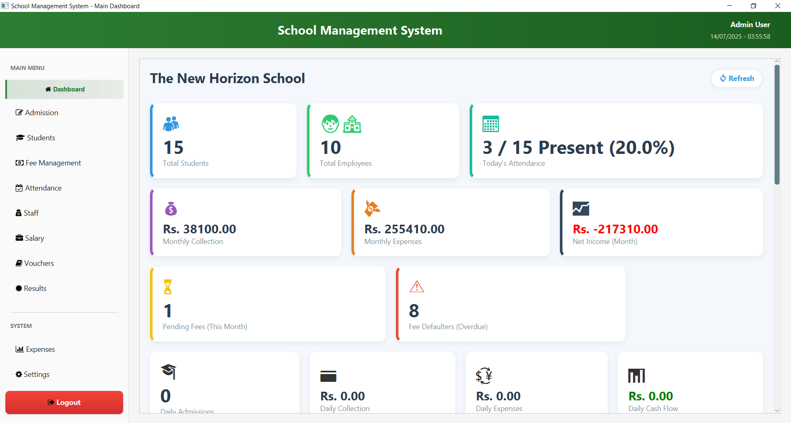
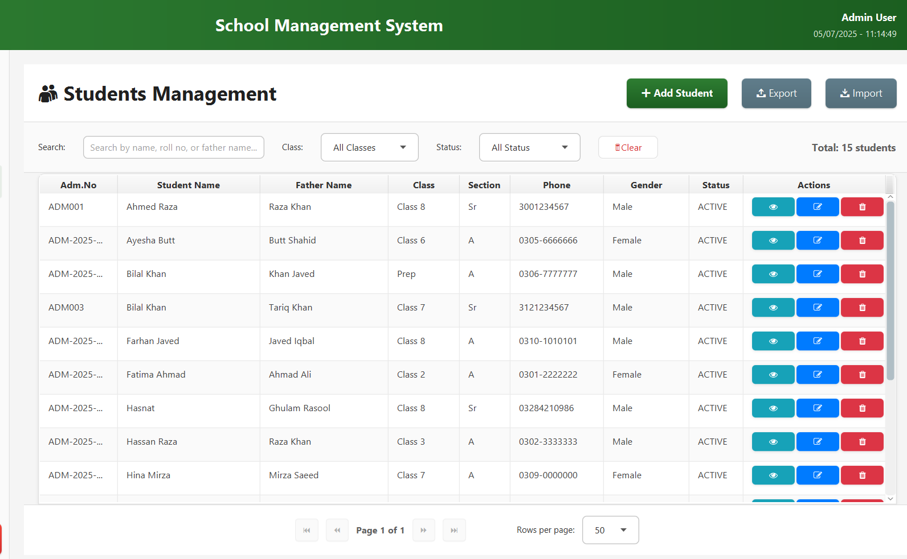
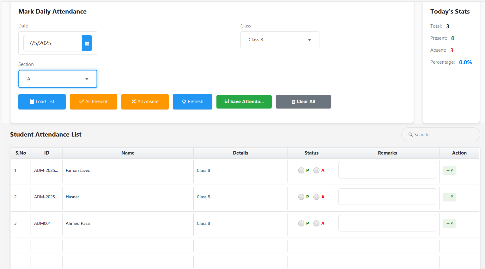

# 🎓 JavaFX School Management System

A fully-featured **School Management System** built using **JavaFX** and **SQLite**, designed to streamline school operations through an intuitive and responsive desktop UI.

🎬 **Watch the Project Demo on YouTube:**  

---

## ✨ Features

- 📚 **Student Management**: Add, update, delete, and view student records.
- 👨‍🏫 **Teacher Management**: Manage teacher profiles and assignments.
- 🏫 **Class & Section Assignment**: Organize and allocate classes and sections.
- 📝 **Subject Management**: Add and manage subjects per class.
- 📅 **Timetable Generation**: Automatically generate class-wise schedules.
- 📋 **Attendance System**: Mark, view, and edit attendance records.
- 📈 **Marks & Grades**: Record and analyze student marks and grades.
- 💾 **SQLite Integration**: Lightweight, self-contained database.
- 💻 **JavaFX UI**: Smooth and responsive user interface for desktop users.

---

## 🖼️ Screenshots

---

## 📞 Contact

**Author**: Hasnat Rasool  
**Email**: hasnatrasool163@gmail.com  
**GitHub**: [https://github.com/hasnatrasool163](https://github.com/hasnatrasool163)

---
